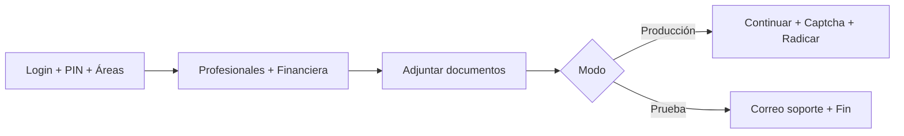

# Guía — Preparar scripts de PRUEBA (Centinela V4)

Guía **general** para convertir cualquier bot `.js` del proyecto en modo **prueba**: el flujo se detiene después de adjuntar documentos y los correos van solo a soporte interno, **sin radicar** en ANNA.

Aplica a **cualquier archivo** que tú indiques (hoy, mañana u otro día), sin importar el nombre.

---

## ¿Cuándo usar esta guía?

| Situación | Acción |
|-----------|--------|
| Validar login, PIN, áreas, documentos | Preparar el `.js` como prueba |
| Competencia o monitoreo real | Usar el `.js` de **producción** (sin estos cambios) |
| Varios bots del mismo PIN/competencia | Lista **cada archivo** que quieras convertir |

> **Recomendación:** trabaja sobre una **copia** del script original y deja intacto el bot de producción. El nombre de la copia puede ser el que quieras (`copy`, `prueba`, `test`, etc.).

---

## ¿Qué cambia en modo prueba?

| Aspecto | Producción | Prueba |
|---------|------------|--------|
| Tras adjuntar documentos | Continúa → captcha → radica | Salta a correo y reinicio |
| Correos de alerta | Lista completa del equipo | Solo `Soporte2ceere@gmail.com` |
| Riesgo en ANNA | Radicación real posible | No radica |



---

## Paso 0 — Elegir qué archivos modificar

1. Decide qué bots pasan a modo prueba.
2. **Escríbelos en una lista** (para ti o para la IA). Ejemplos de formato válido:
   - `NombreDelBot.js`
   - `Competencia X Agente Y.js`
   - `Radi EMPRESA 123456.js`
   - Ruta completa: `C:\Centinela_V4\mi-carpeta\bot.js`
3. Opcional: duplica el original antes de editar.

**Nadie (ni una IA) debe modificar archivos que no estén en tu lista.**

---

## Paso 1 — Quitar la radicación automática final

### Dónde buscar

En el `.js` elegido, localiza la sección de documentos:

- `Documentos_Persona_juridica(page, Empresa)` o
- `Documentos_Persona_Natural(page, Empresa)`

Justo **después** suele empezar el bloque a eliminar:

```javascript
const continPag = await page.$x('//span[contains(.,"Continuar")]');
```

### Qué eliminar

Borra **todo** desde esa línea hasta el `catch` del botón Radicar:

```javascript
// ❌ ELIMINAR (desde continPag hasta el click en Radicar)

const continPag = await page.$x('//span[contains(.,"Continuar")]');
// Clic en Continuar, waitForNavigation, timers Radisegundo/RadiTercero
// Bucles RECAPTCHA, verificarCaptchaResuelto
// Click en botón Radicar

try {
  await btnRadicar1[1].click();
} catch (exepcion) {
  console.log("La 1 tampoco Y_Y");
}
```

### Cómo debe quedar

Tras el `if/else` de documentos, conecta **directo** con:

```javascript
    if (Datos_Empresa.TipoUsuario === 'PJ') {
      await Documentos_Persona_juridica(page, Empresa);
    } else {
      await Documentos_Persona_Natural(page, Empresa);
    }


    //CORREO RADICACION
    Correo(2, Areas[Band].NombreArea, Areas[Band].Referencia);
    await page.waitForTimeout(180000);
    Mineria(browser, Pin);
```

```
Documentos adjuntos
       │
       ▼
  [BLOQUE ELIMINADO]
  Continuar → Captcha → Radicar
       │
       ▼
  //CORREO RADICACION  ← conexión directa
```

---

## Paso 2 — Correo solo a soporte

### Dónde

Función `Correo` → objeto `mailOptions` (cerca del final del archivo).

### Producción (antes)

```javascript
  let mailOptions = {
    from: msg + '"Ceere" <correomineria2@ceere.net>',
    to: "correo1@..., correo2@..., ...",
    //to: '  Soporte2ceere@gmail.com',
    subject: "LA AREA ES-> " + Area,
```

### Prueba (después)

```javascript
  let mailOptions = {
    from: msg + '"Ceere" <correomineria2@ceere.net>',
    //to: "correo1@..., correo2@..., ...",
    to: '  Soporte2ceere@gmail.com',
    subject: "LA AREA ES-> " + Area,
```

**Regla:** una sola línea `to:` activa; la de producción comentada; la de soporte activa.

---

## Paso 3 — Checklist antes de ejecutar

- [ ] Solo modifiqué los archivos de **mi lista**
- [ ] El bot de producción original quedó intacto (si usé copia)
- [ ] No hay `const continPag = await page.$x(...)` después de documentos
- [ ] Tras documentos va directo a `//CORREO RADICACION`
- [ ] En `Correo()`, el `to:` activo es `Soporte2ceere@gmail.com`

---

## Usar la IA (Cursor u otra)

1. Abre `GUIA PRUEBAS/PROMPT_PARA_IA.md`
2. Copia el prompt
3. **Pega tu lista de archivos** (obligatorio)
4. La IA debe confirmar la lista antes de editar
5. Revisa el diff antes de guardar

Si no das la lista, la IA **no debe tocar ningún archivo** y debe pedírtela hasta que la entregues.

---

## Errores frecuentes

| Error | Consecuencia | Solución |
|-------|--------------|----------|
| No listar archivos | Se modifican bots incorrectos | Lista explícita siempre |
| Editar producción por error | Radicación real en prueba | Copiar antes o listar solo copias |
| Borrar desde `//CORREO RADICACION` | No envía aviso | Eliminar solo el bloque Continuar→Radicar |
| Dos líneas `to:` activas | Error de sintaxis | Comentar producción, activar soporte |
| Asumir todos los de una carpeta | Cambios masivos no deseados | Un archivo = una decisión explícita |

---

## Resumen

Esta guía **no depende de un PIN, competencia ni nombre concreto**. Funciona para cualquier bot Centinela V4 que comparta la misma estructura (documentos → continuar/captcha/radicar → correo).

**Correo de pruebas:** Soporte2ceere@gmail.com

Para competencia real, usa los `.js` sin estos cambios.
