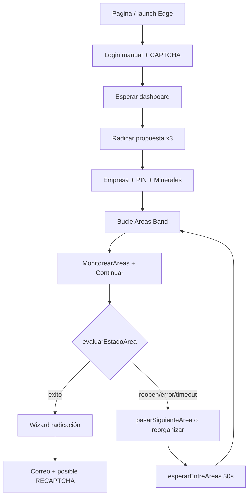

# Contexto Centinela V4 — Bots de minería ANNA

Documento de referencia para IAs y desarrolladores que retomen el proyecto sin acceso al chat original. Describe qué es el sistema, cómo funciona, qué se cambió y decisiones del usuario.

**Repositorio:** `https://github.com/CeereIngeniero1/Centinela_V4.git` (rama `main`)  
**Ruta local típica:** `C:\Centinela_V4`  
**Portal automatizado:** [ANNA Minería — SIGM](https://annamineria.anm.gov.co/sigm/)

---

## 1. ¿Qué hace este proyecto?

Automatización con **Puppeteer** (navegador Edge visible, `headless: false`) del flujo de **radicación y monitoreo de áreas mineras** en el portal de la ANM (Agencia Nacional de Minería).

Cada script `.js` corresponde a una **empresa / operación** y corre de forma continua:

1. Abre el portal y hace login (usuario/contraseña automáticos; **CAPTCHA manual**).
2. Espera el dashboard y radica una propuesta de contrato de concesión.
3. Selecciona empresa (si es agente), PIN, minerales.
4. Entra al formulario de áreas por celdas.
5. **Monitorea en bucle** una lista de áreas hasta detectar liberación, error, reapertura o timeout.
6. Si un área se libera, continúa el wizard (detalles, técnica, profesionales, financiera, documentos, shapefile).
7. Envía **correos de alerta** según el evento.

---

## 2. Scripts principales

| Archivo | Empresa (`Empresa`) | PIN (`CodigoPin`) | Áreas (`ARCHIVO_AREAS`) | Notas |
|---------|---------------------|-------------------|-------------------------|-------|
| `ColleV4.js` | `Collective` | `Co` | `Collective` | Script más actualizado; referencia para cambios |
| `Valleduper.js` | `Valleduper` | `Vl` | `Valleduper` | Misma base que ColleV4; verificar que `CodigoPin` coincida con `Pines.json` (`VL` mayúsculas) |
| `Operadora.js` | `Operadora` | `OP` | `Operadora` | Igual patrón |

Otros scripts históricos en el repo (p. ej. `Collective.js`, `Miranda.js`) pueden no tener la migración JSON/áreas más reciente.

**Ejecutar:** `node ColleV4.js` (desde la carpeta del proyecto, con dependencias instaladas).

**Navegador:** Microsoft Edge en  
`C:\Program Files (x86)\Microsoft\Edge\Application\msedge.exe`

---

## 3. Estructura de carpetas y datos

```
Centinela_V4/
├── ColleV4.js              # Bot Collective (principal)
├── Valleduper.js
├── Operadora.js
├── datosEmpresas.js        # Carga JSON de DatosEMPRESAS/
├── Pin.txt                 # Legacy: lista de pines (ya migrado a Pines.json)
├── .env                    # Legacy; claves CAPTCHA vacías
├── areas/                  # Listas de áreas por grupo (NUEVO)
│   ├── Collective.json
│   └── Operadora.json
└── DatosEMPRESAS/
    ├── Pines.json
    ├── Minerales.json
    ├── InformacionEmpresas.json
    ├── InformacionEconomica.json
    ├── Geologos.json
    ├── Contadores.json
    ├── EquiposGenerales.json
    └── Configuracion.json   # Placeholder CAPTCHA APIs (no usado aún)
```

### 3.1 Constantes al inicio de cada `.js`

Estas tres constantes definen **qué empresa monitorear** sin tocar el resto del código:

```javascript
const Empresa = "Collective";      // Clave en InformacionEmpresas.json, Minerales.json, etc.
const CodigoPin = "Co";            // Clave en Pines.json
const ARCHIVO_AREAS = "Collective"; // Carga areas/Collective.json (sin extensión .json)
```

También hay constantes de tiempos (ms):

| Constante | Valor | Uso |
|-----------|-------|-----|
| `MONITOREO_AREA_MS` | 30_000 | Tiempo máximo monitoreando cada área |
| `INTERVALO_PRIMERA_REVISION_MS` | 1_000 | Primera revisión tras Continuar |
| `INTERVALO_REVISION_AREA_MS` | 5_000 | Revisiones siguientes por área |
| `ESPERA_ENTRE_AREAS_MS` | 30_000 | Pausa entre áreas fallidas/timeout |
| `INTERVALO_REVISION_ENTRE_AREAS_MS` | 3_000 | Revisa si pasó a radicar durante la pausa |
| `TIMEAREA_REINICIO_MS` | 5 * 60_000 | Timer de seguridad: reinicia `Mineria` si el bucle se cuelga |
| `ESPERA_DASHBOARD_MS` | 3_000 | Entre intentos de radicar propuesta |
| `MAX_INTENTOS_DASHBOARD` | 3 | Intentos de `RadicarPropuesta` tras login |

### 3.2 `datosEmpresas.js`

Módulo común que exporta objetos parseados desde `DatosEMPRESAS/`:

- `EquiposGenerales` — hostname → nombre legible del PC
- `Informacion_Empresas` — código ANM, contraseña, nombre, tipo usuario (PN/PJ)
- `Informacion_Economica`, `Geologos`, `Contadores` — datos del wizard por empresa
- `Configuracion` — `CAPTCHA_2_API_KEY`, `NOPECHA_KEY` (vacíos; **ningún script los usa hoy**)

`Pines.json` y `Minerales.json` se cargan **directamente en cada `.js`** con `fs.readFileSync`, no vía `datosEmpresas.js`.

### 3.3 `areas/*.json` (migración junio 2026)

**Antes:** el arreglo `Areas` estaba hardcodeado al final de `ColleV4.js` (~115 líneas, 23 áreas Collective).

**Ahora:** un JSON por grupo en `areas/`. Formato: **array directo**:

```json
[
  {
    "NombreArea": "508750",
    "Referencia": "18N05A25M10T",
    "Celdas": ["18N05A25M10T, 18N05A25M10U"]
  }
]
```

- `NombreArea`: identificador del área en el portal / logs.
- `Referencia`: celda de referencia.
- `Celdas`: array con **un string** que contiene todas las celdas separadas por coma y espacio (formato legacy del portal).

**Para otro grupo:** crear `areas/Valleduper.json` y poner `ARCHIVO_AREAS = "Valleduper"`. `Empresa` y `CodigoPin` son independientes del archivo de áreas.

**Decisión del usuario:** carpeta `areas/` en la raíz del proyecto (no dentro de `DatosEMPRESAS/`).

### 3.4 `Pines.json`

Claves cortas (`Co`, `VL`, `OP`, …) con:

```json
"Co": {
  "pin": "20260602133357",
  "vencimiento": "02/JUL/2026",
  "empresa": "Collective"
}
```

El bot busca en el `<select id="pinSlctId">` la opción que coincida con `pin` o con el texto `"pin, vencimiento"`.

`parseFechaPin()` interpreta fechas tipo `02/JUL/2026` para alertas de vencimiento (`VerificarVencimientoPin`).

### 3.5 `InformacionEmpresas.json`

Empresas soportadas (ejemplos): `Collective`, `Valleduper`, `Operadora`, `Freeport`, `Provenza`, `Miranda`, `ARABANY`, `NegoYMetales`.

Campos: `Codigo`, `Contraseña`, `Nombre`, `TipoUsuario` (`PN` = persona natural, `PJ` = jurídica).

### 3.6 `EquiposGenerales.json`

Mapea `os.hostname()` → nombre para correos (ej. `TUFF16` → `Fernando Ingeniero`).

### 3.7 `Configuracion.json`

Pensado para APIs de resolución automática de CAPTCHA (2Captcha, NopeCHA). **No conectado al código.** El login usa espera manual; `RECAPTCHA()` usa simulación de teclado con `@nut-tree-fork/nut-js`.

---

## 4. Variables globales de flujo

| Variable | Rol |
|----------|-----|
| `Band` | Índice del área actual en `Areas[]` (0-based) |
| `ContadorVueltas` | Contador de reinicios del flujo completo |
| `contreapertura` | Límite de correos por reapertura de celdas (máx. 2 envíos tipo 3) |
| `ComparacionCeldas` | Array de celdas parseadas del área actual (para reorganizar) |
| `areaFiltrado` | Celdas disponibles tras quitar las no disponibles |
| `Agente` | `1` = login agente (`96233` / `SuperAgente86*`) + selección empresa; `0` = credenciales de `InformacionEmpresas` |
| `EnviarCorreosParaPestanas` | Evita spam si hay ≥4 pestañas abiertas |
| `CorreoAvisoLoginEnviado` | Un solo correo tipo 7 si login manual tarda >2 min |

---

## 5. Flujo principal (`Mineria`)

```
Pagina() → puppeteer.launch → Mineria(browser, Pin)
```

### 5.1 Login (`Login`)

- Va a `https://annamineria.anm.gov.co/sigm/`
- Escribe `#username` y `#password`
- **No resuelve CAPTCHA:** espera indefinidamente (`timeout: 0`) hasta URL dashboard  
  `https://annamineria.anm.gov.co/sigm/index.html#/extDashboard`
- Si pasan **2 minutos** sin dashboard → `Correo(7)` una sola vez

### 5.2 Radicar propuesta (`esperarDashboardYRadicar`)

- Hasta 3 intentos × 3 s
- Menú Solicitudes → "Radicar solicitud de propuesta de contrato de concesión"
- Si falla los 3 → cierra página y reinicia `Mineria`

### 5.3 PIN y empresa

- Si `Agente == 1`: `Agente_Selecion_Empresa` escribe código en `#submitterPersonOrganizationNameId` y elige el enlace con el nombre de la empresa.
- `seleccionar_Pin` → `colocarPin` → Continuar → `Minerales`
- Si aparece error rojo **"PIN es obligatorio"** (`detectarErrorPinObligatorio`): `recuperarEmpresaYPin` y reintento (máx. 1 vez con `Veces`).
- Durante el bucle de áreas también se revisa si sigue en pantalla PIN (`sigueEnPantallaPin`).

### 5.4 Minerales (`Minerales`)

- Lee `MineralesPorEmpresa[Empresa]` de `Minerales.json`
- Marca checkboxes de minerales en el modal del portal

### 5.5 Bucle de monitoreo (`while (true)`)

Para `Areas[Band]`:

1. `MonitorearAreas` — escribe celdas en `#cellIdsTxtId` (dispara `change` de Angular). **No limpia** el campo entre áreas; solo se reemplaza al colocar la siguiente área.
2. `clickContinuar`
3. `esperarResultadoMonitoreoArea` — polling con `evaluarEstadoArea`:
   - `exito` → URL contiene `#/p_CaaIataInputTechnicalEconomicalDetails` → `Correo(1)`, sale del bucle
   - `reopen` → mensaje `CELL_REOPENING_DATE` → `Correo(3)` si `contreapertura < 2`, `pasarSiguienteArea`
   - `error` → celdas no disponibles / errores en pestañas → `intentarReorganizarArea` o `pasarSiguienteArea`
   - `pendiente` → tras 30 s → `pasarSiguienteArea`
4. `esperarEntreAreas` — 30 s con chequeo cada 3 s por si pasó a `exito`
5. Timer `TimeArea` — 5 min reinicia todo si algo se traba

`pasarSiguienteArea`: solo incrementa `Band`; al llegar al final vuelve a `0`. **No borra** `#cellIdsTxtId`.

### 5.6 Reorganización de celdas (`intentarReorganizarArea`)

- Lee enlaces `.errorMsg` con "Las siguientes celdas de selección no están disponibles:"
- Filtra `ComparacionCeldas` quitando las no disponibles
- Si quedan celdas → `MonitorearAreas` con lista filtrada y reintenta monitoreo
- **Legacy:** `if (Band == 81) return false` — de cuando había 82+ áreas; con 23 áreas no aplica

### 5.7 Tras liberar área

Secuencia: `Detalles_de_area` → `Informacion_tecnica` → `Profesionales` → `Informacion_financiera` → documentos / shapefile → posible `RECAPTCHA` → `Correo(2)` radicada, etc.

### 5.8 Recuperación de errores

- `reiniciarMineria` — limpia timers, cierra página, vuelve a llamar `Mineria`
- Try/catch en bucle de áreas y en el async de `Mineria`
- `clickContinuar` — clic robusto en botones "Continuar"
- Errores tipo "Node is detached" → reinicio

---

## 6. Correos (`Correo(Tipo, Area, Celda)`)

SMTP: `mail.ceere.net:465`, usuario `correomineria2@ceere.net`

| Tipo | Significado |
|------|-------------|
| 1 | Posible área liberada |
| 2 | Área radicada |
| 3 | Área con fecha de reapertura |
| 4 | Verificar (genérico) |
| 5 | Demasiadas pestañas abiertas (≥4) |
| 6 | reCAPTCHA detectado |
| 7 | Login manual lleva ~2 minutos |

Destinatarios configurados en el HTML del correo (varios correos Ceere/Jorge).

---

## 7. Cambios realizados en la conversación (resumen)

1. **Migración de `.env` a JSON** en `DatosEMPRESAS/` (pines, minerales, empresas, geólogos, contadores, etc.) vía `datosEmpresas.js`.
2. **Login manual + CAPTCHA:** espera indefinida al dashboard; correo tipo 7 a los 2 min.
3. **PIN robusto:** detección "PIN es obligatorio", `recuperarEmpresaYPin`, `parseFechaPin`.
4. **Monitoreo de áreas refactorizado:** constantes de tiempo, `evaluarEstadoArea`, logs de validación N, `esperarEntreAreas`, try/catch, `reiniciarMineria`.
5. **Celdas:** no se limpia `#cellIdsTxtId` tras error; solo se actualiza en `MonitorearAreas`.
6. **Áreas dinámicas:** `areas/Collective.json` + `ARCHIVO_AREAS` al inicio de `ColleV4.js` (y replicado en `Valleduper.js`, `Operadora.js`).
7. **`Configuracion.json`:** creado pero sin uso en código (CAPTCHA automático pendiente).

---

## 8. Preferencias y decisiones del usuario

- **Commits:** solo cuando el usuario lo pida explícitamente.
- **Áreas:** carpeta `areas/` en raíz; por ahora migración aplicada a los scripts que el usuario fue actualizando (`ColleV4`, `Valleduper`, `Operadora`).
- **Alcance áreas JSON:** inicialmente solo `ColleV4.js`; luego se extendió a otros `.js` hermanos con el mismo patrón.
- **No modificar** el archivo de plan en `.cursor/plans/` cuando implementa.
- Quiere documentación en `contexto/` para futuras IAs si pierde el chat.

---

## 9. URLs y selectores importantes del portal

| Elemento | Selector / URL |
|----------|----------------|
| Login user/pass | `#username`, `#password` |
| Dashboard | `#/extDashboard` |
| Éxito área liberada | `#/p_CaaIataInputTechnicalEconomicalDetails` |
| PIN | `select#pinSlctId` |
| Empresa agente | `#submitterPersonOrganizationNameId` |
| Celdas | `#cellIdsTxtId` |
| Método celdas | `select#selectedCellInputMethodSlctId` |
| Tipo terreno | `select[name="areaOfConcessionSlct"]` → "Otro tipo de terreno" |
| reCAPTCHA response | `#g-recaptcha-response` |
| iframe desafío imágenes | `iframe[src*="bframe"]` |

---

## 10. Dependencias npm relevantes

- `puppeteer` — automatización navegador
- `colors` — logs en consola
- `nodemailer` — correos
- `@nut-tree-fork/nut-js` — teclado/ratón para `RECAPTCHA()`

---

## 11. Problemas conocidos / puntos de atención

1. **`Valleduper.js`:** `CodigoPin = "Vl"` pero `Pines.json` usa `"VL"` — puede fallar la carga del PIN; alinear mayúsculas.
2. **`areas/Valleduper.json`:** `Valleduper.js` referencia este archivo; verificar que exista antes de ejecutar.
3. **`Band == 81`:** código legacy de reorganización; considerar mover a flag en JSON por área si vuelve a crecer el listado.
4. **Credenciales en código:** `user2`/`pass2` del agente y SMTP están hardcodeados en los `.js` (no en JSON).
5. **`Minerales(page)`** puede estar comentado en algunos puntos del flujo en versiones antiguas; en ColleV4 se llama desde `seleccionar_Pin` cuando aparece el botón de minerales.

---

## 12. Cómo extender el sistema

### Nueva empresa

1. Añadir entrada en `InformacionEmpresas.json`, `Minerales.json`, `Geologos.json`, etc.
2. Añadir PIN en `Pines.json`.
3. Crear `areas/NombreEmpresa.json` con el listado de áreas.
4. Copiar `ColleV4.js` → `NuevaEmpresa.js` y ajustar `Empresa`, `CodigoPin`, `ARCHIVO_AREAS`.

### Nueva área en Collective

Editar solo `areas/Collective.json`; no hace falta tocar el `.js` si `ARCHIVO_AREAS` ya es `Collective`.

### Cambiar tiempos de monitoreo

Editar las constantes `MONITOREO_AREA_MS`, `ESPERA_ENTRE_AREAS_MS`, etc. al inicio del `.js` correspondiente.

---

## 13. Diagrama de flujo simplificado



---

## 14. Historial de archivos legacy

- `Pin.txt` — formato `-Co:pin, fecha;` — reemplazado por `Pines.json` pero el archivo puede seguir en disco.
- `.env` — variables CAPTCHA; migración parcial a `Configuracion.json`.
- Arreglo `const Areas = [...]` al final de los `.js` — **eliminado** en ColleV4; usar `areas/*.json`.

---

*Última actualización de contexto: junio 2026 — basado en trabajo sobre ColleV4, migración JSON de áreas, y configuración multi-empresa (Collective, Valleduper, Operadora).*
