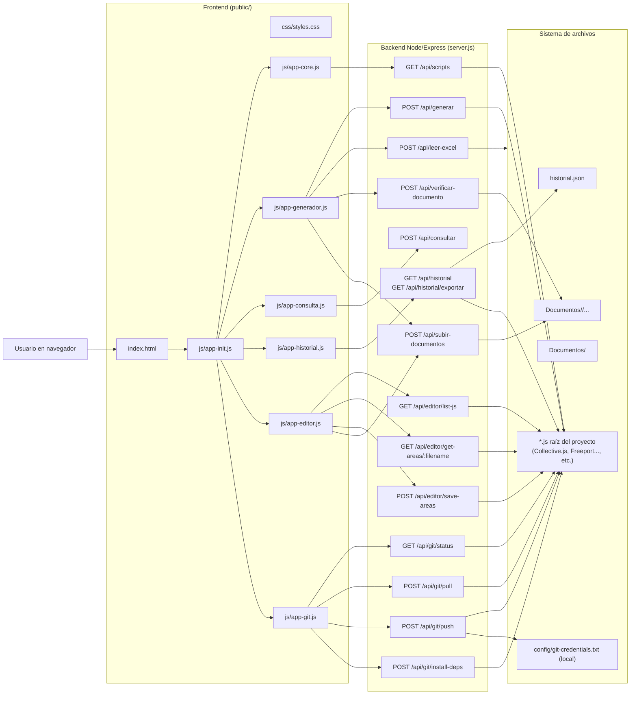

## Arquitectura general de Centinela

Este documento resume cómo se conectan el frontend, el backend y el sistema de archivos en la aplicación Centinela (Generador de Scripts, Buscador, Historial, Editor de JS y módulo Git).

### Diagrama de alto nivel

### Resumen por capas

- **Frontend (`public/`)**
  - `index.html`: estructura de la interfaz (sidebar, formularios de Generador, Consulta, Historial, Editor de JS y Git).
  - `css/styles.css`: estilos visuales.
  - `js/app-core.js`: estado global (modo actual, contadores), toasts y utilidades compartidas (`loadScripts`, `loadClientes`, `autoCompletarReferencia`, etc.).
  - `js/app-generador.js`: lógica del formulario Generador (áreas, Excel, cliente, documentos y llamada a `/api/generar` y `/api/subir-documentos`).
  - `js/app-consulta.js`: Buscador / Consulta, llama a `/api/consultar` y pinta la tabla de resultados.
  - `js/app-historial.js`: vista de Historial, consume `/api/historial` y muestra la tabla.
  - `js/app-editor.js`: Editor de JS (lista scripts, carga áreas de `const Areas`, permite editar y guardar, y subir documentos por área).
  - `js/app-git.js`: lógica del panel Git (estado del repo, pull con opción forzada, push y ejecución de `npm install` con confirmaciones).
  - `js/app-init.js`: punto de arranque (`DOMContentLoaded`), registra listeners y llama a `loadScripts()`, `loadClientes()` y `agregarArea()`.

- **Backend (`server.js`)**
  - Servidor Express en `http://localhost:3001`.
  - Endpoints:
    - Generador: `/api/scripts`, `/api/generar`.
    - Consulta: `/api/consultar`.
    - Historial: `/api/historial`, `/api/historial/exportar`.
    - Excel: `/api/leer-excel`.
    - Documentos: `/api/verificar-documento`, `/api/subir-documentos`.
    - Editor de JS: `/api/editor/list-js`, `/api/editor/get-areas/:filename`, `/api/editor/save-areas`.
    - Git: `/api/git/status`, `/api/git/pull`, `/api/git/push`, `/api/git/install-deps`.

- **Sistema de archivos**
  - Raíz del proyecto: scripts `.js` (Collective, Freeport, etc.) que sirven como base o destino del generador y editor.
  - `historial.json`: registro estructurado de las generaciones, consumido por la vista Historial y las exportaciones.
  - `config/git-credentials.txt` (opcional/local): credenciales para `git push` desde la web, ignoradas por `.gitignore`.
  - `Documentos/`:
    - Subcarpeta por cliente (`Documentos/<Cliente>`).
    - Dentro de cada cliente: `DocumentosReglamentarios/`, `CertificadoAmbiental/`, `Sheips/`, donde se guardan los archivos subidos desde la app.

